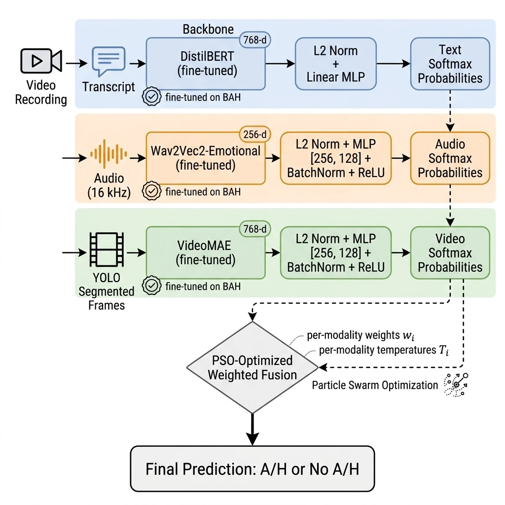

# Multimodal A/H Classification on the BAH Dataset

Binary classification of Behavioral Ambivalence/Hesitancy (A/H) from video recordings, using text, audio, and video modalities fused through a late-fusion pipeline.



## Dataset

The project uses the BAH (Behavioral Ambivalence/Hesitancy) dataset containing approximately 1500 short video recordings of people.  Each video is labelled with one of two classes:

| Label | Meaning |
|-------|---------|
| 0     | No A/H  |
| 1     | With A/H |

### Structure on disk

```
data/
  split/                  # video-level splits (train.txt, val.txt, test.txt)
  split-frames/           # frame-level splits
  Videos/                 # original .mp4 files
  Frames/                 # extracted frames from videos
  SegmentedFrames/        # YOLO-segmented body crops
  audio/                  # pre-extracted audio (.wav / .mp3)
  transcription/          # YAML transcription files
  cropped-aligned-faces/  # face crops (not used in the current pipeline)
```

Split files follow the format `video_path,label,transcript` for video-level and `frame_path,label` for frame-level splits.

## Project structure

```
text/           # text modality: fine-tuning scripts and weights
audio/          # audio modality: fine-tuning scripts and weights
video/          # video modality: fine-tuning scripts and weights
multimodal/     # embedding extraction, early and late fusion training
  cache/        # cached per-modality embeddings (.pt)
  src/          # extraction and fusion training code
  weights/      # trained MLP heads, scalers, meta artifacts
utils/          # shared dataset loaders, augmentation utilities
demo/           # live demo application (Tkinter)
requirements.txt
```

## Per-modality backbones

All backbone encoders are first fine-tuned on the BAH dataset for binary A/H classification.  The fine-tuned weights are then frozen and used to extract fixed-size embeddings for every sample.

### Text

Two interchangeable text backbones are supported:

- **DistilBERT** (`distilbert-base-uncased`) -- 6-layer, 66M-parameter encoder.  Produces a 768-dimensional CLS embedding.
- **DistilRoBERTa-Emotional** (`j-hartmann/emotion-english-distilroberta-base`) -- 6-layer, 82M-parameter encoder pretrained on 7-way emotion classification.

Fine-tuning scripts are in `text/src/distilbert/` and `text/src/robert/`.  The active backbone is selected via `text.backbone` in `multimodal/src/config.toml`.

Training-time text augmentation includes random word masking (replacing tokens with `[MASK]`) and random word deletion, implemented in `utils/augmentation.py`.

### Audio

Two interchangeable audio backbones are supported:

- **Wav2Vec2-Emotional** (`ehcalabres/wav2vec2-lg-xlsr-en-speech-emotion-recognition`) -- large XLSR model pretrained on English speech emotion recognition.  Outputs a 256-dimensional projected embedding.
- **HuBERT** (`superb/hubert-large-superb-er`) -- large HuBERT model pretrained on emotion recognition via the SUPERB benchmark.  Also outputs a 256-dimensional projected embedding.

Fine-tuning scripts are in `audio/src/wav2vecemotional/` and `audio/src/hubert/`.  The active backbone is selected via `audio.backbone` in `multimodal/src/config.toml`.

Audio is resampled to 16 kHz and clipped/padded to a configurable maximum duration (default 30 seconds).  Optional waveform augmentation (gain, additive noise, time shift, time masking) is available but disabled by default because the frozen wav2vec2-emotional encoder performs worse on augmented waveforms.

### Video

Two interchangeable video backbones are supported:

- **Swin-Tiny** (`microsoft/swin-tiny-patch4-window7-224`) -- vision transformer operating on clips of 32 consecutive frames.  Mean-pooled output produces a 768-dimensional embedding.
- **VideoMAE** (`MCG-NJU/videomae-base`) -- masked autoencoder for video, operating on clips of 16 frames.  Mean-pooled temporal output produces a 768-dimensional embedding.

Fine-tuning scripts are in `video/src/swin_segmented_frames/` and `video/src/videomae_segmented_frames/`.  The active backbone is selected via `video.backbone` in `multimodal/src/config.toml`.

Before embedding extraction, video frames are passed through a YOLO11x-seg instance segmentation model to crop the person from each frame.  This removes background noise and forces the model to attend to body language.  Frames where no person is detected are marked with `.skip` sentinel files.  Video augmentation (horizontal flip, brightness/contrast jitter, frame jitter) is applied during multi-view extraction for training samples.

## Embedding extraction (stage 1)

Each backbone is used to embed every sample into a fixed-length vector.  To increase training diversity without re-running the full backbone at every epoch, we extract multiple augmented views per training sample (configurable via `extraction.num_views_train`, default 5).  Validation and test samples use a single deterministic view.

Extraction scripts:
- `multimodal/src/extract_text.py`
- `multimodal/src/extract_audio.py`
- `multimodal/src/extract_video.py`

Output caches are saved as PyTorch tensors in `multimodal/cache/` with filenames following the pattern `{modality}_{backbone}_embs_{split}.pt`.

Configuration for extraction is in `multimodal/src/config.toml`.

## Fusion

### Early fusion

`multimodal/src/fusion_training.py` implements an early-fusion pipeline:

1. StandardScaler per modality (fitted on training data).
2. Concatenation into a single vector.
3. Optional PCA dimensionality reduction.
4. Classifier: MLP, SVM, Random Forest, or Gradient Boosting (XGBoost / CatBoost).

Configuration is in `multimodal/src/config.toml` under `[fusion]`.

### Late fusion

`multimodal/src/late_fusion_training.py` implements the primary late-fusion pipeline, configured by `multimodal/src/config_late_fusion.toml`.

#### Per-modality MLP heads

Each modality gets an independent MLP head trained on its own cached embeddings.  The MLP architecture (`ModalityMLP`) supports the following configurable components:

- **Input normalization**: L2 normalization (per-sample `x / (||x||_2 + eps)`) or StandardScaler, selected via the `normalization` key.
- **Gaussian noise**: Optional additive Gaussian noise on the input during training (`gaussian_noise` key), acting as regularization.
- **Hidden layers**: Configurable via `hidden_dims` (list of integers).  An empty list produces a direct linear classifier.
- **BatchNorm**: Optional BatchNorm1d after each hidden linear layer, before activation (`use_batchnorm` key).
- **Activation**: ReLU or GELU, selected via the `activation` key.
- **Dropout**: Applied after activation in each hidden layer, plus optional `input_dropout` on the raw embedding.

Training uses AdamW with either a cosine annealing (`CosineAnnealingLR`) or plateau-based (`ReduceLROnPlateau`) learning rate scheduler, early stopping on validation macro-F1, gradient clipping, and label smoothing.

Default configurations per modality (current settings):

| Modality | hidden_dims | normalization | activation | scheduler | LR   | patience |
|----------|------------|---------------|------------|-----------|------|----------|
| Text     | []         | L2            | ReLU       | plateau   | 1e-3 | 20       |
| Audio    | [256, 128] | L2            | ReLU       | plateau   | 5e-4 | 20       |
| Video    | [256, 128] | L2            | ReLU       | plateau   | 1e-4 | 20       |

#### Probability fusion

After training the per-modality heads, their softmax outputs on the validation set are used to optimize fusion parameters.  Two approaches are combined:

1. **Temperature scaling**: Per-modality temperature parameters calibrate each head's softmax outputs (dividing logits by T before softmax).

2. **PSO-optimized weighted averaging**: Particle Swarm Optimization jointly searches for per-modality weights and temperatures that maximize macro-F1 on the validation set.  Two variants are evaluated:
   - Probability space: weighted average of calibrated softmax probabilities.
   - Logit space: weighted average of calibrated logits followed by a single softmax.

   PSO parameters (swarm size, iterations, inertia, cognitive/social acceleration) are configured in the `[pso]` section.

The fusion metadata (weights, temperatures, optional meta-stacker) is saved in `multimodal/weights/late_fusion_meta.joblib`.

## Demo application

`demo/app.py` is a Tkinter-based GUI for live A/H detection.  It opens the computer camera, records video and audio simultaneously, then runs the full inference pipeline:

1. Extract or use recorded audio.
2. Transcribe audio with OpenAI Whisper.
3. Run YOLO person segmentation on video frames.
4. Extract text, audio, and video embeddings using the fine-tuned backbones.
5. Run the late-fusion classifier with PSO-optimized weights.
6. Display the prediction in the UI.

A scrollable log sidebar shows each pipeline step.  Configuration is in `demo/config.toml`.

### Running the demo

```bash
python demo/app.py
```

Requires a webcam and microphone.  Model weights must be present in `text/weights/`, `audio/weights/`, `video/weights/`, and `multimodal/weights/`.

## Requirements

Install dependencies:

```bash
pip install -r requirements.txt
```

Key dependencies: PyTorch 2.6, HuggingFace Transformers, ultralytics (YOLO), OpenAI Whisper, OpenCV, scikit-learn, librosa, sounddevice, Pillow.

A CUDA-capable GPU is needed for training and embedding extraction.  The demo can run on CPU.

## Training

### 1. Fine-tune backbones

Each backbone is fine-tuned independently on the BAH dataset:

```bash
# Text (DistilBERT)
cd text/src/distilbert && bash run_training.sh

# Audio (Wav2Vec2-Emotional)
cd audio/src/wav2vecemotional && bash run_training.sh

# Audio (HuBERT, alternative)
cd audio/src/hubert && bash run_training.sh

# Video (VideoMAE)
cd video/src/videomae_segmented_frames && bash run_training.sh

# Video (Swin-Tiny, alternative)
cd video/src/swin_segmented_frames && bash run_training.sh
```

### 2. Extract embeddings

With fine-tuned weights in place, extract cached embeddings:

```bash
cd multimodal/src
bash run_embeddings_text.sh
bash run_embeddings_audio.sh
bash run_embeddings_video.sh
```

### 3. Train late-fusion heads

```bash
cd multimodal/src
bash run_late_fusion_training.sh
```

This trains per-modality MLP heads, runs PSO weight optimization, and saves all artifacts to `multimodal/weights/`.

## Configuration files

| File | Purpose |
|------|---------|
| `multimodal/src/config.toml` | Backbone selection, extraction settings, early fusion |
| `multimodal/src/config_late_fusion.toml` | Late fusion MLP heads and PSO settings |
| `demo/config.toml` | Demo application paths and model settings |
| `text/src/distilbert/config.toml` | DistilBERT fine-tuning hyperparameters |
| `audio/src/wav2vecemotional/config.toml` | Wav2Vec2-Emotional fine-tuning hyperparameters |
| `audio/src/hubert/config.toml` | HuBERT fine-tuning hyperparameters |
| `video/src/videomae_segmented_frames/config.toml` | VideoMAE fine-tuning hyperparameters |
| `video/src/swin_segmented_frames/config.toml` | Swin-Tiny fine-tuning hyperparameters |
